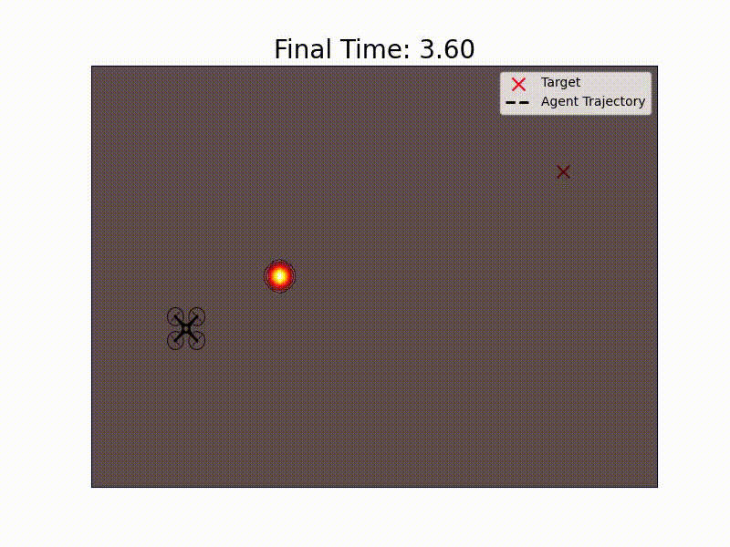
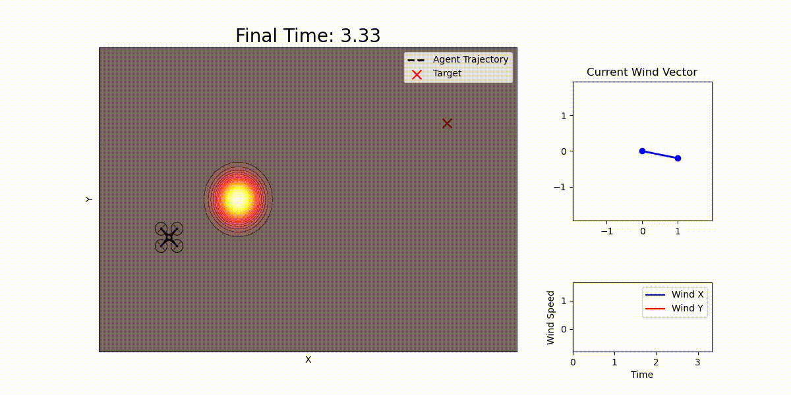
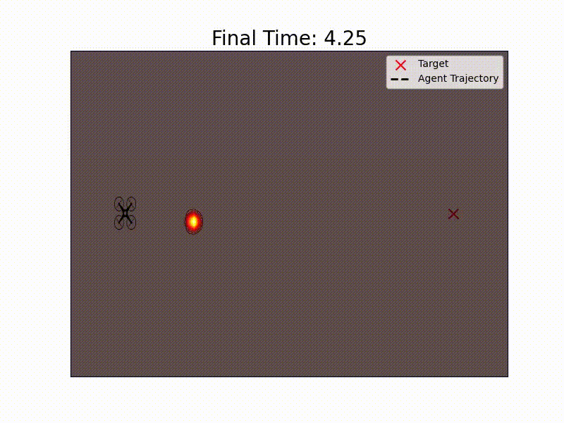
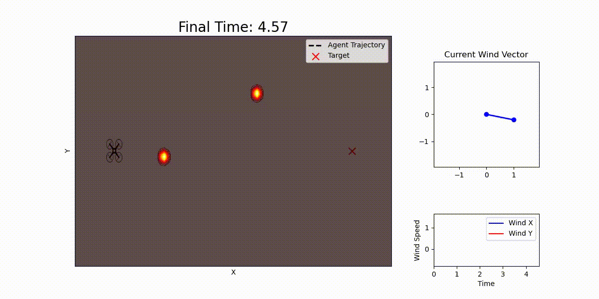

# Wildfires
	Max Fennimore, Josh Hoagy land, Elisha Sampson, Matt "Wally" Shumway
	ACME Volume 4b Project
	Winter 2025

Optimal control for agentic search and rescue through dynamic wildfire-like obstacles.

